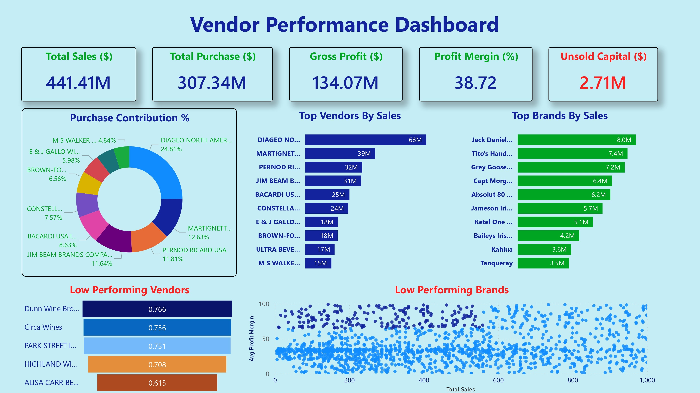

# 📑 Vendor Performance Analysis - Retail Inventory & Sales

_Analyzing vendor efficiency and profitability to support strategic purchasing and inventory decisions using SQL, Python, and Power BI._

---

## 📌 Table of Contents
- <a href="#overview">Overview</a>
- <a href="#business-problem">Business Problem</a>
- <a href="#dataset">Dataset</a>
- <a href="#tools--technologies">Tools & Technologies</a>
- <a href="#project-structure">Project Structure</a>
- <a href="#data-cleaning--preparetion">Data Cleaning & Preparetion</a>
- <a href="#exploratory-data-analysis-eda">Exploratory Data Analysis (EDA)</a>
- <a href="#research—questions--key-findings">Research Questions & Key Findings</a>
- <a href="#dashboard">Dashboard</a>
- <a href="#how-to-run-this-project">How to Run This Project</a>
- <a href="#final-recomendations">Final Recomendations</a>
- <a href="#author--contact">Author & Contact</a>

---
<h2><a class="anchor" id="overview"></a>Overview</h2>

This project evaluates vendor performance and retail inventory dynamics to drive strategic insights for purchasing, pricing, and inventory optimization. A complete data pipeline was built using SQL for ETL, Python for analysis and hypothesis testing, and Power BI for visualization.

---
<h2><a class="anchor" id="business-problem"></a>Business Problem</h2>

Effective inventory and sates management are critical in the retail sector. This project aims to:
- Identify underperforming brands needing pricing or promotional adjustments
- Determine vendor contributions to sales and profits
- Analyze the cost-benefit of bulk purchasing
- Investigate inventory turnover inefficiencies
- Statistically validate differences in vendor profitability

---
<h2><a class="anchor" id="dataset"></a>Dataset</h2>

- Multiple CSV files located in `/data/` folder (sales, vendors, inventory)
- Summary table created from ingested data and used for analysis

---

<h2><a class="anchor" id="tools--technologies"></a>Tools & Technologies</h2>

- SQL (Common Table Expressions, Joins, Filtering)
- Python (Pandas, Matplotlib, Seaborn, SciPy)
- Power BI (Interactive Visualizations)
- GitHub

---
<h2><a class="anchor" id="project-structure"></a>Project Structure</h2>

```
vendor-performance-analysis/

├── README.md
├── .gitignore
├── requirements.txt
├── Vendor Performance Report.pdf
│
├── notebooks/                         # Jupyter notebooks
│   ├── exploratory_data_analysis.ipynb
│   └── vendor_performance_analysis.ipynb
│
├── scripts/                           # Python scripts for ingestion and processing
│   ├── ingestion_db.py
│   └── get_vendor_summary.py
│
└── dashboard/                         # Power BI dashboard file
│   └── vendor_performance_dashboard.pbix
```

---
<h2><a class="anchor" id="data-cleaning--preparetion"></a>Data Cleaning & Preparetion</h2>

- Removed transactions with:
    - Gross Profit ≤ 0
    - Profit Margin ≤ 0
    - Sales Quantity = 0
- Created summary tables with vendor-level metrics
- Converted data types, handled outliers, merged lookup tables

---
<h2><a class="anchor" id="exploratory-data-analysis-eda"></a>Exploratory Data Analysis (EDA)</h2>

**Negative or Zero Values Detected:**
- Gross Profit: Min -52,002.78 (loss—making sales)
- Profit Margin: Min -∞ (sates at zero or below cost)
- Unsold Inventory: Indicating slow-moving stock

**Outliers Identified:**
- High Freight Costs (up to 257K)
- Large Purchase/Actual Prices

**Correlation Analysis:**
- Weak between Purchase Price & Profit
- Strong between Purchase Qty & Sales Qty (0.999)
- Negative between Profit Margin & Sates Price (-0.179)

---
<h2><a class="anchor" id="research—questions--key-findings"></a>Research Questions & Key Findings</h2>

1. **Brands for Promotions**: 198 brands with tow sates but high profit margins
2. **Top Vendors**: Top 10 vendors = 65.69% of purchases → risk of over-reliance
3. **Bulk Purchasing Impact**: 72% cost savings per unit in large orders
4. **Inventory Turnover**: $2.71M worth of unsold inventory
5. **Vendor Profitability**:
    - High Vendors: Mean Margin = 31.17%
    - Low Vendors: Mean Margin = 41.55%
6. **Hypothesis Testing**: Statistically significant difference in profit margins → distinct vendor strategies

---
<h2><a class="anchor" id="dashboard"></a>Dashboard</h2>

- Power BI Dashboard shows:
    - Vendor—wise Sales and Margins
    - Inventory Turnover
    - Bulk Purchase Savings
    - Performance Heatmaps



---
<h2><a class="anchor" id="how-to-run-this-project"></a>How to Run This Project</h2>

1. Clone the repository:
```bash
git clone https://github.com/sayanmanna575/vendor-performance-analysis-sql-python-powerbi.git
```
2. Load the CSVs and ingest into database:
```bash
python scripts/ingestion_db.py
```
3. Create vendor summary table:
```bash
python scripts/get_vendor_summary.py
```
4. Open and run notebooks:
    - `notebooks/exploratory_data_analysis.ipynb`
    - `notebooks/vendor_performance_analysis.ipynb`
5. Open Power BI Dashboard:
    - dashboard/vendor_performance_dashboard.pbix

---
<h2><a class="anchor" id="final-recomendations"></a>Final Recomendations</h2>

- Diversify vendor base to reduce risk
- Optimize bulk order strategies
- Reprice stow—moving, high—margin brands
- Clear unsold inventory strategically
- Improve marketing for underperforming vendors

---
## 👤 Author & Contact

**Sayan Manna**  
Data Analyst

📧 **Email:** [sayanmanna6397@gmail.com](mailto:sayanmanna6397@gmail.com)  
🔗 **LinkedIn:** [sayanmanna575](https://www.linkedin.com/in/sayanmanna575/)  
🌐 **Portfolio:** [sayanmanna.me](https://sayanmanna.me/)